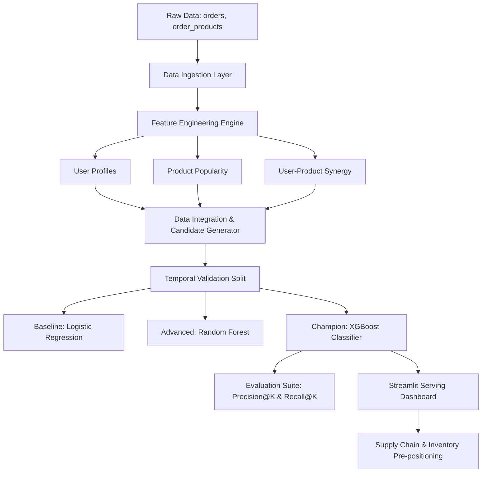
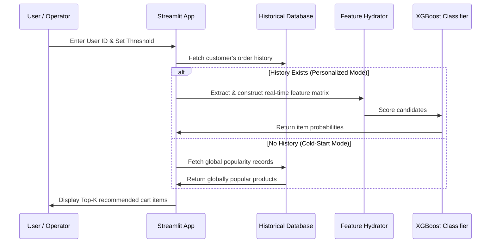

# 🛒 Retail Oracle: Predictive Cart Intelligence & Supply Chain Optimization
## Detailed ML Project Report

This report provides a comprehensive, step-by-step breakdown of the **Retail Oracle** system—a predictive cart intelligence pipeline designed to anticipate user purchases using the Instacart dataset. By predicting which items a user will reorder in their next session, the system enables real-time e-commerce personalization and powers proactive supply chain caching.

---

## 🗺️ System Overview

Predictive Cart Intelligence treats product recommendation as a **supervised binary classification task**. Rather than using traditional collaborative filtering (which struggles to capture highly personalized temporal habit patterns), this system scores the likelihood that a user will reorder a previously purchased product in their upcoming order.



---

## 1. Data Ingestion & Memory Management
**File Reference:** [data_ingestion.py](file:///c:/Users/shubh/OneDrive/Desktop/Project_ML/Instacart_Predictive_Cart/instacart_pipeline/data_ingestion.py)

### Concepts & Rationale
The Instacart dataset is massive, containing millions of rows (especially the prior order product details). In-memory processing of such datasets requires careful engineering to prevent out-of-memory (OOM) crashes:
* **Memory Reduction**: Standard pandas loading reads numeric data in 64-bit precision (`int64`, `float64`). However, identifiers (like user ID or product ID) and small quantities (like add-to-cart order) can fit in 16-bit or 32-bit types.
* **Chunking**: For files containing tens of millions of rows (such as `order_products__prior.csv`), the data is loaded in iterator chunks to restrict memory spikes.

### Code Walkthrough
The `InstacartDataLoader` class manages this pipeline:

```python
class InstacartDataLoader:
    def __init__(self, data_path="./data"):
        self.data_path = data_path
        
    def load_table(self, file_name, usecols=None, chunksize=None, nrows=None):
        path = f"{self.data_path}/{file_name}"
        logging.info(f"Loading {file_name} from {path}...")
        
        try:
            if chunksize:
                chunks = []
                for chunk in pd.read_csv(path, usecols=usecols, chunksize=chunksize, nrows=nrows):
                    chunks.append(reduce_mem_usage(chunk))
                return pd.concat(chunks, axis=0)
            else:
                df = pd.read_csv(path, usecols=usecols, nrows=nrows)
                return reduce_mem_usage(df)
        except Exception as e:
            logging.error(f"Failed to load {file_name}: {e}")
            return pd.DataFrame()
```
* **Parameters**:
  - `chunksize`: Reads the file in subsets (e.g. 1,000,000 rows at a time) to prevent excessive memory usage.
  - `nrows`: Limits the row count loaded in real-time runs (such as the Streamlit app) to guarantee low latency.

---

## 2. Exploratory Data Analysis (EDA)
**File Reference:** [eda.py](file:///c:/Users/shubh/OneDrive/Desktop/Project_ML/Instacart_Predictive_Cart/instacart_pipeline/eda.py)

### Concepts & Rationale
EDA reveals structural behaviors and purchasing patterns in e-commerce:
1. **Temporal Patterns**: Customer ordering behaviors vary by day-of-week (DOW) and hour-of-day. Pre-caching schedules in warehouses can be optimized around these distributions.
2. **Interval Patterns**: The `days_since_prior_order` shows peak ordering spikes at 7 days and 30 days, suggesting weekly and monthly subscription-like habits.
3. **Department Reorder Invariance**: Certain departments (like produce and dairy) display much higher reorder rates than others (like personal care or household items).

### Code Walkthrough
The `DataExplorer` class automates visual diagnostics:
```python
def plot_reorder_rate_by_department(self, merged_df):
    if 'reordered' not in merged_df.columns or 'department' not in merged_df.columns:
        return
    reorder_rates = merged_df.groupby('department')['reordered'].mean().sort_values(ascending=False)
    plt.figure(figsize=(12,8))
    sns.barplot(x=reorder_rates.values, y=reorder_rates.index, palette='viridis')
    plt.title('Reorder Rate by Department')
    plt.tight_layout()
    plt.savefig(f"{self.output_dir}/reorder_rate_by_dept.png")
    plt.close()
```
* **Insight**: Aggregates the binary target `reordered` (0 or 1) grouped by `department`. The mean value corresponds directly to the empirical reorder rate.

---

## 3. Feature Engineering Deep Dive
Feature engineering is the core of this system. Rather than passing simple IDs, the system builds complex profiles to capture purchasing patterns.

### A. User-Level Features
**File Reference:** [user_features.py](file:///c:/Users/shubh/OneDrive/Desktop/Project_ML/Instacart_Predictive_Cart/instacart_pipeline/feature_engineering/user_features.py)

User features describe the shopper’s general behavior, irrespective of the specific items they purchase:
1. **Total Orders (`u_total_orders`)**: Indicates loyalty and how much interaction history is available.
2. **Average Basket Size (`u_avg_basket_size`)**:
   $$\text{Avg Basket Size} = \frac{\sum \text{Max Add-to-Cart position per order}}{\text{Total Orders}}$$
3. **User Reorder Ratio (`u_reorder_ratio`)**: The percentage of products in the shopper's cart that they have purchased before. High ratios indicate routine shoppers; low ratios indicate explorers.
4. **Average Days Between Orders (`u_avg_days_between_orders`)**: Measures shopping frequency.

```python
user_orders = self.orders_df.groupby('user_id')['order_number'].max().to_frame('u_total_orders')
basket_size = merged.groupby(['user_id', 'order_id'])['add_to_cart_order'].max().reset_index()
avg_basket_size = basket_size.groupby('user_id')['add_to_cart_order'].mean().to_frame('u_avg_basket_size')
user_reorder_ratio = merged.groupby('user_id')['reordered'].mean().to_frame('u_reorder_ratio')
```

---

### B. Product-Level Features
**File Reference:** [product_features.py](file:///c:/Users/shubh/OneDrive/Desktop/Project_ML/Instacart_Predictive_Cart/instacart_pipeline/feature_engineering/product_features.py)

Product features describe general demand patterns, independent of individual shoppers:
1. **Total Purchases (`p_total_purchases`)**: Represents popularity. Highly popular items (like bananas) have high baseline reorder rates.
2. **Global Reorder Probability (`p_reorder_prob`)**:
   $$p\_reorder\_prob = \frac{\text{Number of Reorders}}{\text{Total Purchases}}$$
3. **Average Cart Position (`p_avg_cart_position`)**: Dictates when the product is typically added. Crucial items (like milk or fresh fruit) are usually added first, whereas impulse items are added near the end.

```python
p_total_purchases = self.prior_df.groupby('product_id').size().to_frame('p_total_purchases')
p_reorder_prob = self.prior_df.groupby('product_id')['reordered'].mean().to_frame('p_reorder_prob')
p_avg_cart_pos = self.prior_df.groupby('product_id')['add_to_cart_order'].mean().to_frame('p_avg_cart_position')
```

---

### C. User-Product Interaction Features
**File Reference:** [interaction_features.py](file:///c:/Users/shubh/OneDrive/Desktop/Project_ML/Instacart_Predictive_Cart/instacart_pipeline/feature_engineering/interaction_features.py)

These features capture the specific relationship between a customer and a product:
1. **User-Product Total Purchases (`up_total_purchases`)**: How many times this user bought this product.
2. **Recency Tracker (`up_first_order_num` & `up_last_order_num`)**: Maps when the product was first and last purchased.
3. **Interaction Order Rate (`up_order_rate`)**:
   $$\text{up\_order\_rate} = \frac{\text{up\_total\_purchases}}{\text{u\_total\_orders} - \text{up\_first\_order\_num} + 1}$$
   This captures frequency since the customer first discovered the item. An item bought in every single order since it was first discovered will have an order rate of $1.0$.

```python
up_purchases = merged.groupby(['user_id', 'product_id']).size().to_frame('up_total_purchases')
up_first_order = merged.groupby(['user_id', 'product_id'])['order_number'].min().to_frame('up_first_order_num')
up_last_order = merged.groupby(['user_id', 'product_id'])['order_number'].max().to_frame('up_last_order_num')
up_features['up_order_rate'] = up_features['up_total_purchases'] / (up_features['u_total_orders'] - up_features['up_first_order_num'] + 1)
```

---

## 4. Modeling Strategy & Validation
**File Reference:** [baseline.py](file:///c:/Users/shubh/OneDrive/Desktop/Project_ML/Instacart_Predictive_Cart/instacart_pipeline/modeling/baseline.py) & [advanced_models.py](file:///c:/Users/shubh/OneDrive/Desktop/Project_ML/Instacart_Predictive_Cart/instacart_pipeline/modeling/advanced_models.py)

### A. Candidate Generation Filter
Building features for every user and every product in the catalog ($N \times M$) results in a sparse matrix too large for standard memory. 
> [!IMPORTANT]
> **Heuristic Filtering Strategy**: Row generation is strictly limited to $(User, Product)$ pairs where the user has purchased the product **at least once** in their history. This reduces the feature space by over 99.9% while keeping 100% of potential reorder candidates.

### B. Validation Split
Traditional random split strategies (such as K-Fold Cross-Validation) lead to **data leakage** because user habits change over time. Using future purchase data to predict past purchases artificially boosts metrics but fails in production.
- **Solution**: **Temporal Time-Based Split**. The final known order for each user is held out as the validation set, while all prior orders are used for feature computation and training.

### C. Models Evaluated
1. **Logistic Regression (Baseline)**:
   - Evaluates whether the features have basic linear predictive power.
   - Requires continuous variables to be standardized.
2. **Random Forest Classifier**:
   - Captures non-linear feature combinations and interactions.
   - Computationally expensive at scale due to deep decision trees.
3. **XGBoost Classifier (Champion)**:
   - High-performance gradient boosted decision trees.
   - Handles missing data naturally and optimizes binary classification loss functions (logloss) efficiently.

```python
# XGBoost configuration within advanced_models.py
self.xgb_model = xgb.XGBClassifier(
    n_estimators=200, 
    max_depth=6, 
    learning_rate=0.1, 
    n_jobs=-1, 
    random_state=42
)
```

---

## 5. Evaluation & Business Metrics
**File Reference:** [business_metrics.py](file:///c:/Users/shubh/OneDrive/Desktop/Project_ML/Instacart_Predictive_Cart/instacart_pipeline/evaluation/business_metrics.py)

Standard metrics like classification accuracy are highly misleading for imbalanced datasets: if a user reorders only 5 items out of a 50,000 product catalog, a model that predicts "no reorder" for everything achieves 99.99% accuracy. 

Instead, the system relies on **Precision@K** and **Recall@K**:

### Precision@K
Calculates the proportion of recommended items that the user actually purchased in their next order:
$$\text{Precision@K} = \frac{\text{Recommended Items} \cap \text{Actual Reordered Items}}{K}$$

### Recall@K (Primary Business Metric)
Calculates what percentage of the user's actual reorder list was captured in our recommended slots:
$$\text{Recall@K} = \frac{\text{Recommended Items} \cap \text{Actual Reordered Items}}{\text{Total Actual Reorders}}$$

```python
top_k_preds = group.nlargest(k, 'score')['product_id'].tolist()
actuals = grouped_true.get_group(user_id)
actual_reorders = actuals[actuals['reordered'] == 1]['product_id'].tolist()

hits = len(set(top_k_preds).intersection(set(actual_reorders)))
precision = hits / k
recall = hits / len(actual_reorders)
```

---

## 6. Streamlit Client Dashboard
**File Reference:** [app.py](file:///c:/Users/shubh/OneDrive/Desktop/Project_ML/Instacart_Predictive_Cart/app.py)

The dashboard allows real-time evaluation and testing of the pipeline:



### Cold-Start Fallback Strategy
If a user is new (fewer than 5 historical orders), personalized predictions are unavailable. The dashboard gracefully falls back to recommending products with the highest global reorder probabilities (`p_reorder_prob`) and purchase frequencies (`p_total_purchases`).

---

## 7. Downstream Supply Chain & E-Commerce Impact

The predictive capabilities of this pipeline drive optimization across the retail supply chain:

| Supply Chain Component | Optimization Mechanism | Business Impact |
| :--- | :--- | :--- |
| **Warehouse Caching** | Predicts local high-demand items 24-48 hours before orders are placed, enabling proactive inventory positioning. | Reduces warehouse transit bottlenecks. |
| **Out-of-Stock Prevention** | Anticipates recurring purchases of high-velocity staple items (e.g., dairy, produce) to trigger automatic reordering. | Minimizes missed purchases due to stockouts. |
| **Delivery Logistics** | Pre-arranges storage layouts based on expected order combinations to speed up physical cart picking. | Cuts delivery times and courier dispatch lag. |
| **Marketing Personalization** | Pre-populates shopping carts with personalized recommendations, reducing checkout steps. | Boosts conversion rate and average basket size. |
